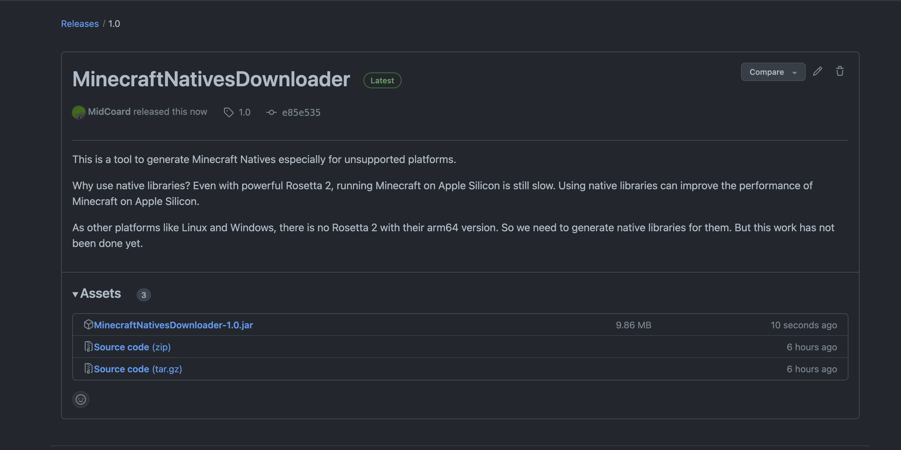
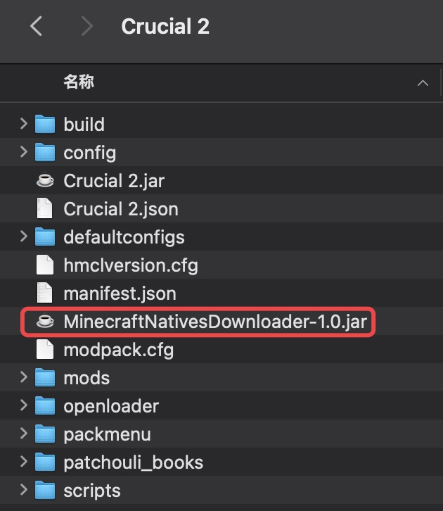
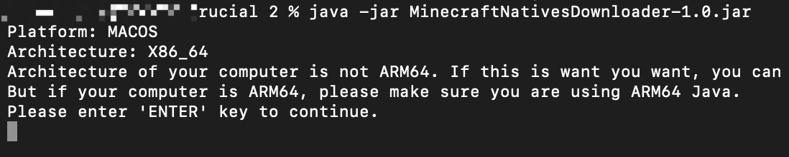
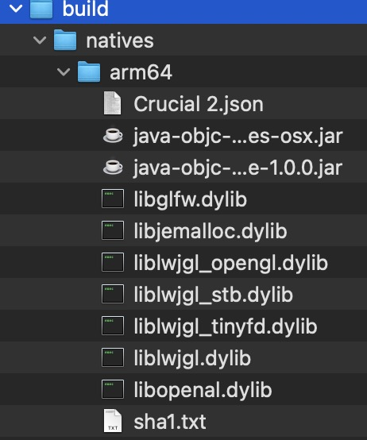
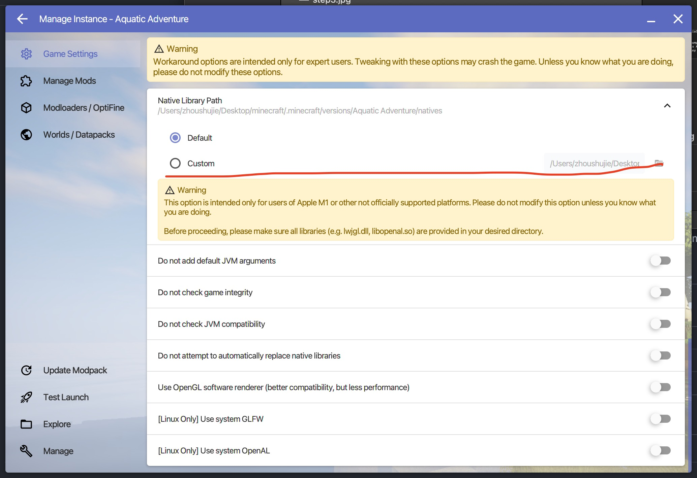
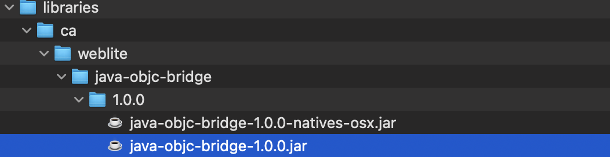
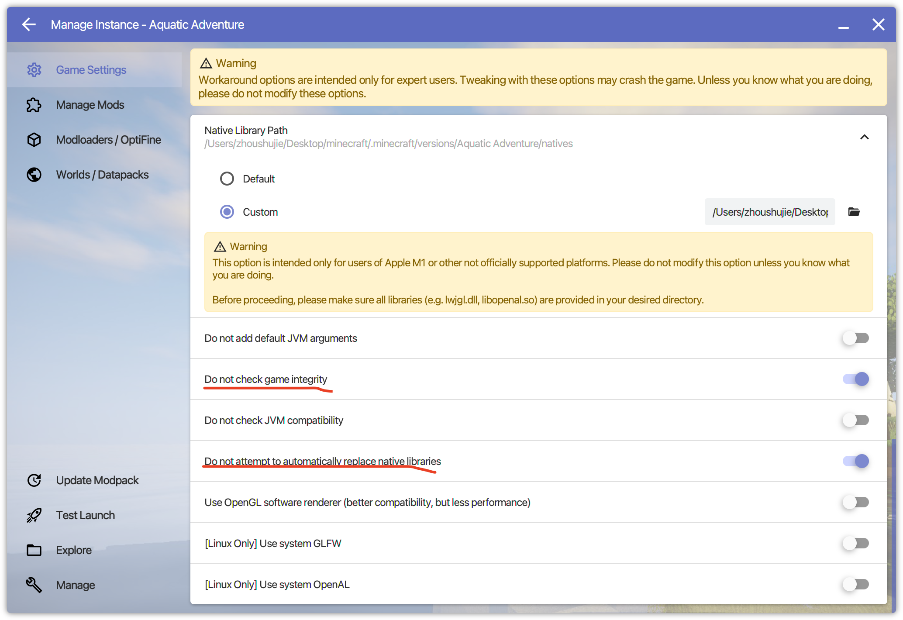
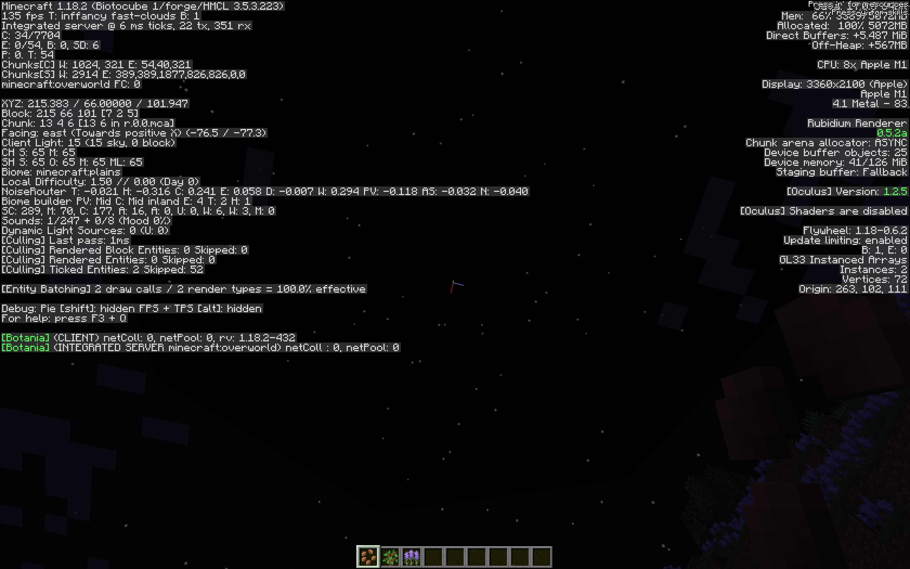
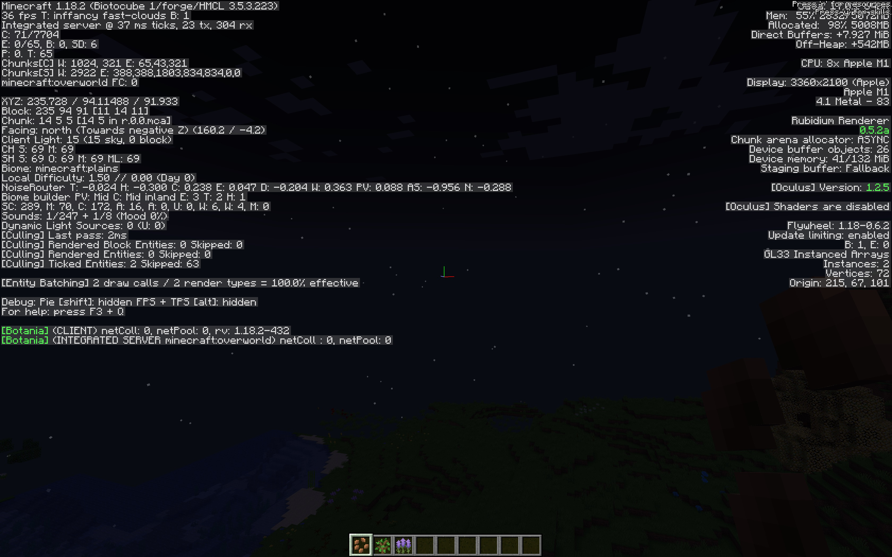

# MinecraftNativesDownloader - Generate Minecraft Natives Especially for Unsupported Platforms.

# Description

This is a tool to generate Minecraft Natives especially for unsupported platforms.

Why use native libraries? Even with powerful Rosetta 2, running Minecraft on Apple Silicon is still slow. Using native libraries can improve the performance of Minecraft on Apple Silicon.

As other platforms like Linux and Windows, there is no Rosetta 2 with their arm64 version. So we need to generate native libraries for them. But this work has not been done yet.

# Usage

## Before All

Considering macos arm64 platform, the natives we all need are listed below

- liblwjgl.dylib 
- liblwjgl_opengl.dylib
- liblwjgl_stb.dylib
- liblwjgl_tinyfd.dylib

The above four natives are needed by lwjgl. They can all be built from lwjgl source code.

- libglfw.dylib

This is glfw library. It can be downloaded from Glfw official website.

- libopenal.dylib

This is openal library. It can be built from openal source code.

- libjemalloc.dylib

This is jemalloc library. It can be built from jemalloc source code.

- libjcocoa.dylib

This library is needed by java-objc-bridge, which is needed by Text2Speech.

This tool is used to generate the above natives and their dependencies.

## Requirements

1. Even with natives, you need a launcher that could use the user-defined natives. I choose [HMCL](https://github.com/huanghongxun/HMCL) as my launcher. You can choose any launcher you like. But seems like Minecraft Official Launcher does not support user-defined natives.
2. If you use macos arm64 platform, you should install [arm64 Java 8](https://www.azul.com/downloads/) or other arm64 Java version matching your Minecraft version and set it as your default Java.

## Steps

1. Download this tool in the release page.

2. Put this tool in the specific version directory and run, or run with --path <Miencraft Version Path>

then run
```bash
   java -jar MinecraftNativesDownloader-1.0.jar
```

3. After running, if you use HMCL, you can move the natives in the build/natives directory to the specific directory provided by HMCL.

Select `Custom` and enter the path of the natives' directory.

**Replace the `<version>.json` file and start the game to download correct jna and jna-platform jar files.**
4. If you use macos arm64 platform, you need to find out where the java-objc-bridge library in the minecraft libraries directory exists and replace it with the built java-objc-bridge library.

Disable check game integrity in HMCL. Disable automatically replace native libraries in HMCL.

## CLI

```bash
--path <Miencraft Version Path> Generate Minecraft naives by specified Minecraft version path
--no-change-mode Do not change mode of building files.
--help Show this help message
--ignore-error Ignore error when building native files
--no-clean Do not clean the build files
--clean Clean the native files
--ignore-lwjgl Ignore building lwjgl
--ignore-glfw Ignore building glfw
--ignore-jemalloc Ignore building jemalloc
--ignore-openal Ignore building openal
--ignore-compile-templates Ignore compile-templates in building lwjgl
--ignore-bridge Ignore building bridge for specified os
--build-lwjgl Only build lwjgl
```

## Warning

You may need prebuild some libraries to build jemalloc and openal. If you have any problems building these libraries on your platform, check the output files in the `build` directory.

# Screenshots

The image below shows the performance of Minecraft on Apple Silicon with and without native libraries.



Minimal fps is 100.



Minimal fps is 33.

It runs on the same modpack with 165 mods, and arm64 version running fps is three times as much as x86_64 version.

The comparison of the performance of Minecraft on Apple Silicon with and without native libraries is not official. It is just a test result of my own.

# Supported Platform

|        | Windows | Linux | Macos |
|:------:|:-------:|:-----:|:-----:|
|  X86   |    -    |   -   |  ❌❌   |
| X86_64 |    -    |   -   |   ✅   |
| arm64  |    ❌    |   ❌   |   ✅   |

❌❌ means not planned,
❌ means not supported , ✅ means supported, - means not tested or not matter.

# Supported Minecraft Versions

We do not care about the versions higher than 1.19, which are officially supported. You can still generate native libraries for higher versions, but it is meaningless.

The above table shows the supported Minecraft versions, which are tested.
If you have tested other versions, please tell me through issues.

- 1.18.2 (Under the same modpack, the running fps of arm64 version is 3 times as much as x86_64 version.)
- 1.16.5 (Under the same modpack, the running fps of arm64 version is at least 90, and the running fps of x86_64 version is at least 40.)
- 1.13.2 (Under the same modpack, the running fps of arm64 version is at least 120, and the running fps of x86_64 version is at least 80 with some stops. )

# Contribution

If you have any ideas or suggestions, please open an issue or pull request.

Platforms with the unsupported architecture such as **Windows arm64** or **Linux arm64** is welcome to contribute.

# License

This project is licensed under the AGPL-3.0 License - see the [LICENSE](LICENSE) file for details